# Intelligent Applications with Azure SQL

Azure SQL can be used to build intelligent applications.

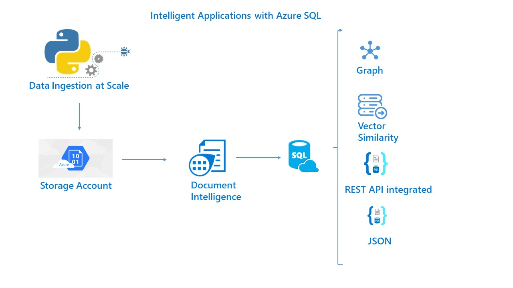

## Overview
Combine the power of Azure SQL and OpenAI and use familiar tools to create enhanced intelligent database solutions.

In this code, using a python Jupyter Notebook we ingest a large number of documents from a storage account (or you can use a SharePoint Site, code is there), save the chunked information into an Azure SQL database using a stored procedure.

The stored procedure saves data to the documents table, saves the embeddings and creates similarity vector table, as well as saving key phrases into a graph table for searching.

You can use the AskDocumentQuestion Stored procedure that takes system message and question as parameters to answer question about your data.

## Key Concepts

To implement this solution the following components were used

- Azure SQL Database features:
    - <a href="https://learn.microsoft.com/en-us/sql/relational-databases/graphs/sql-graph-overview?view=sql-server-ver16" target="_blank">Graph Tables</a>
    - <a href="https://devblogs.microsoft.com/azure-sql/azure-sql-database-external-rest-endpoints-integration-public-preview/" target="_blank">   Rest Point Call functionality</a>
    - <a href="https://learn.microsoft.com/en-us/azure/azure-sql/database/json-features?view=azuresql" target="_blank"> JSON Features </a>

- Azure AI Services
    - <a href="https://learn.microsoft.com/en-us/azure/ai-services/document-intelligence/overview?view=doc-intel-4.0.0" target="_blank">   Azure Document Intelligence </a>
    - <a href="https://learn.microsoft.com/en-us/azure/ai-services/openai/concepts/models" target="_blank" >Azure OpenAI Chat model</a>
    - <a href="https://learn.microsoft.com/en-us/azure/ai-services/openai/concepts/models#embeddings-models" target="_blank" >Azure OpenAI Embeddings model</a>

    ## Assets

This repository containes the following assets and code:

- Azure SQL Database bacpac file
- Requirements.txt
- SQLGraphRag Jupiter Notebook with code needed to ingest documents into your database
- Sample documents

## Services used for this solution

Listed below are the services needed for this solution, if you don't have an azure subscription, you can create a free one. If you already have an subscription, please make sure that your administration has granted access to the services below:

* Azure Subscription
* [Azure SQL Serverless](https://learn.microsoft.com/en-us/azure/azure-sql/database/serverless-tier-overview?view=azuresql)
* [Azure OpenAI Services](https://learn.microsoft.com/en-us/azure/ai-services/openai/overview)
* [Azure Document Intelligence](https://learn.microsoft.com/en-us/azure/ai-services/document-intelligence/overview?view=doc-intel-4.0.0)
* [Azure AI Language ](https://learn.microsoft.com/en-us/azure/ai-services/language-service/overview)

Programming Tools needed:

* [VS Code](https://code.visualstudio.com/)

## Expected time to completion
This project should take about 1 hour to complete

## Setup Steps

> [!IMPORTANT] 
> Before you begin, clone this repository to your local drive

1. [Azure account - login or create one](#task-1---azure-account)
2. [Create a resource group](#task-2---create-a-resource-group)
3. [Create a Storage Account](#task-3---create-a-storage-account)
4. [Create the Azure SQL Database](#task-4---create-the-sql-server-database)
5. [Create OpenAI Account and Deploy Models](#task-5---create-openai-account-and-deploy-models)
6. [Create Azure Document Intelligence Service](#task-6---create-azure-document-intelligence-service)
7. [Create Azure AI Language Service](#task-7---create-azure-ai-language-service)
8. [Upload documents to storage account](#task-8---upload-documents-to-storage-account)
9. [Configure Stored Procedure](#task-9---configure-stored-procedure)

## Ingestion and SQL Configuration

1. [Set up enviromental variables](#task-1---set-up-enviromental-variables)
2. [Run Notebook to ingest](#task-2---run-notebook-to-ingest)
3. [Ask Question](#task-3---ask-question)

### Task 1 - Azure Account

First, you will need an Azure account.  If you don't already have one, you can start a free trial of Azure [here](https://azure.microsoft.com/free/).  

Log into the [Azure Portal](https://azure.portal.com) using your credentials


### Task 2 - Create a resource group

If you are new to Azure, a resource group is a container that holds related resources for an Azure solution. The resource group can include all the resources for the solution, or only those resources that you want to manage as a group, click [here](https://learn.microsoft.com/en-us/azure/azure-resource-manager/management/manage-resource-groups-portal#create-resource-groups) to learn how to create a group

> Write the name of your resource group on a text file, we will need it later

### Task 3 - Create a Storage Account

If you don't have a storage account yet, please create one, to learn more about creating a storage account, click 
  [here](https://learn.microsoft.com/en-us/azure/storage/common/storage-account-create?tabs=azure-portal).

  Create a container name, you can use `nasa-documents` or create your own name

  > Note the storage account name and access key and the container name in your text file.

### Task 4 - Create the SQL Server Database

Upload the file `nasa-documents.bacpac` located under the folder `data-files` to a storage account in your subscription.

  Import the database package to a serverless database, for more information on how to do this click [here](https://learn.microsoft.com/en-us/azure/azure-sql/database/database-import?view=azuresql&tabs=azure-powershell).

  > [!IMPORTANT] Configure your database as a `Hyperscale - Serverless database`
  
<!-- <details>
  <summary>   If you have never done this expand this section for detailed steps  </summary>

Click on create new resource and search for SQL Server (logical server) and select that option

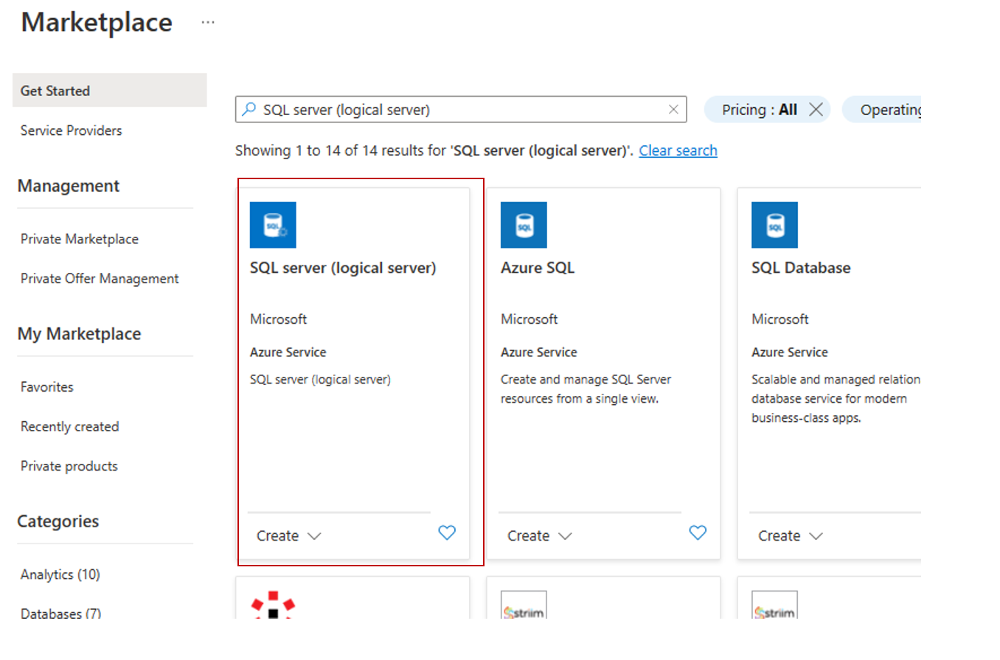

Click the create button

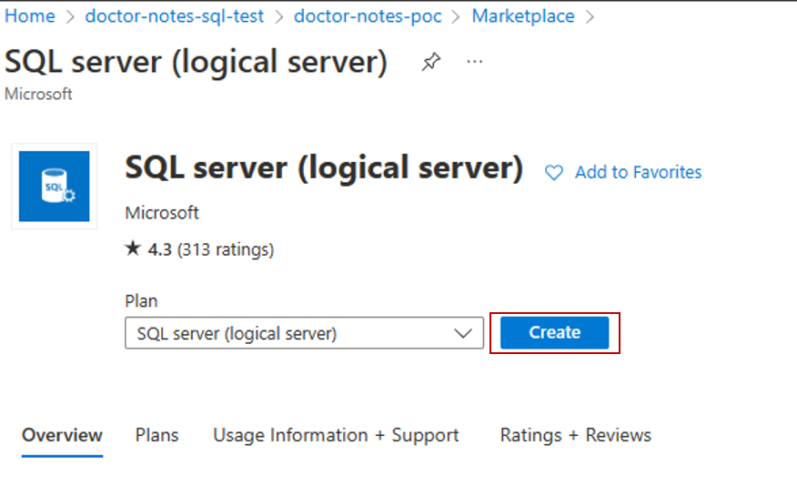

Select the resource group you previously created

Enter a name for the server and a location that matches the location of your resource group. Select use both SQL and Azure AD authentication, add yourself as Azure AD admin. Enter a not easy to guess user name and password for the server. Click Networking

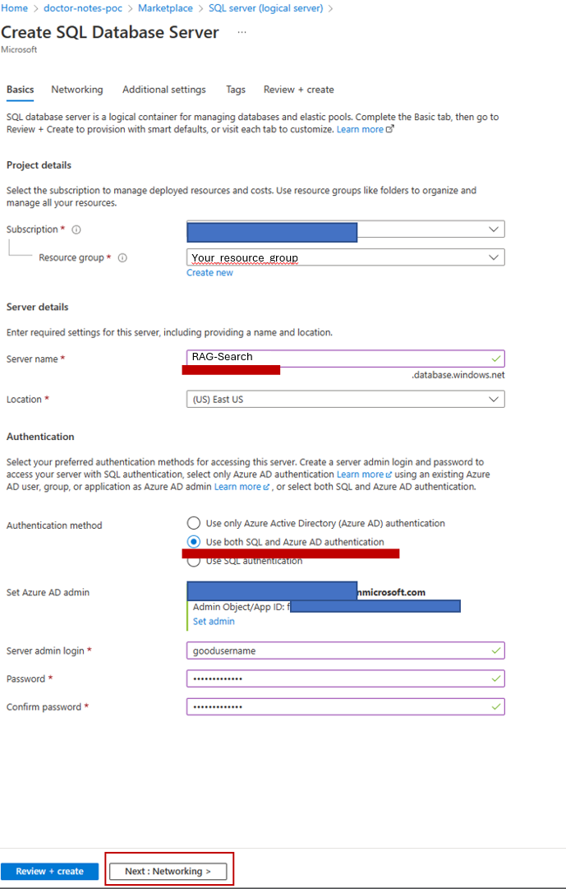

Under firewall rules select Allow Azure Services and resources to access this server. Click Review + create

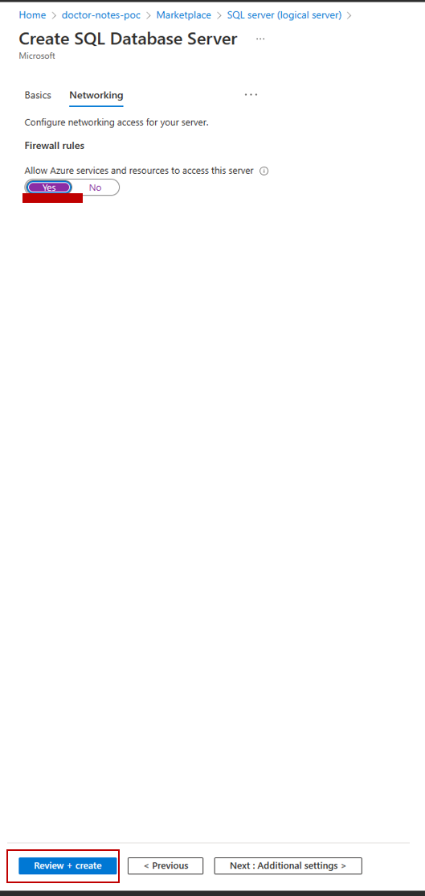

Verify all information is correct, click on "Create"

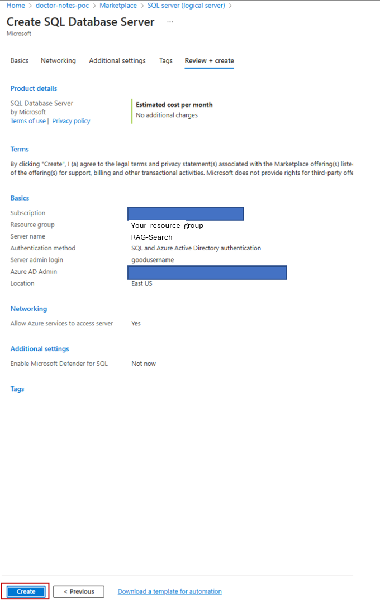

Once your database is created, navigate to your new SQL Server and click on Import Database

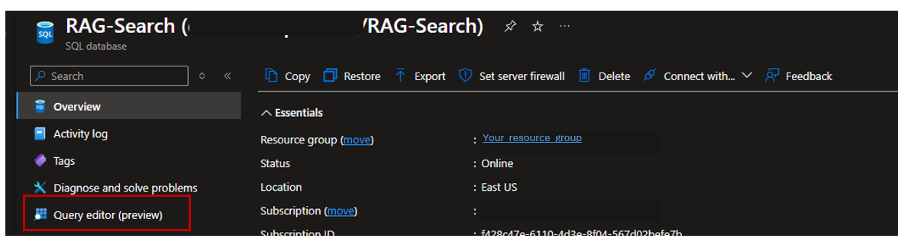

Once on the Import dabase select backup

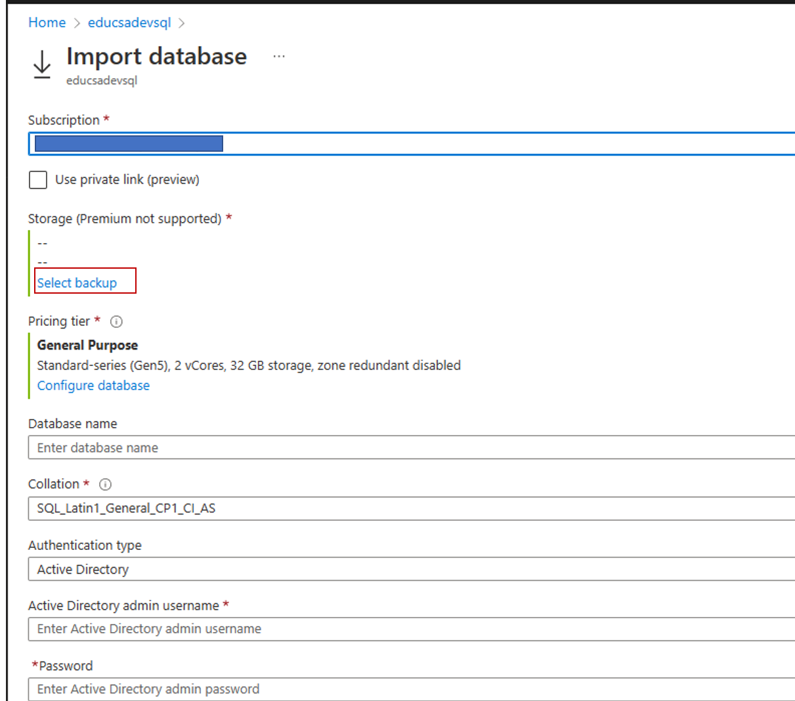

Select the storage account where you uploaded the database file and navigate to the file. Click Select

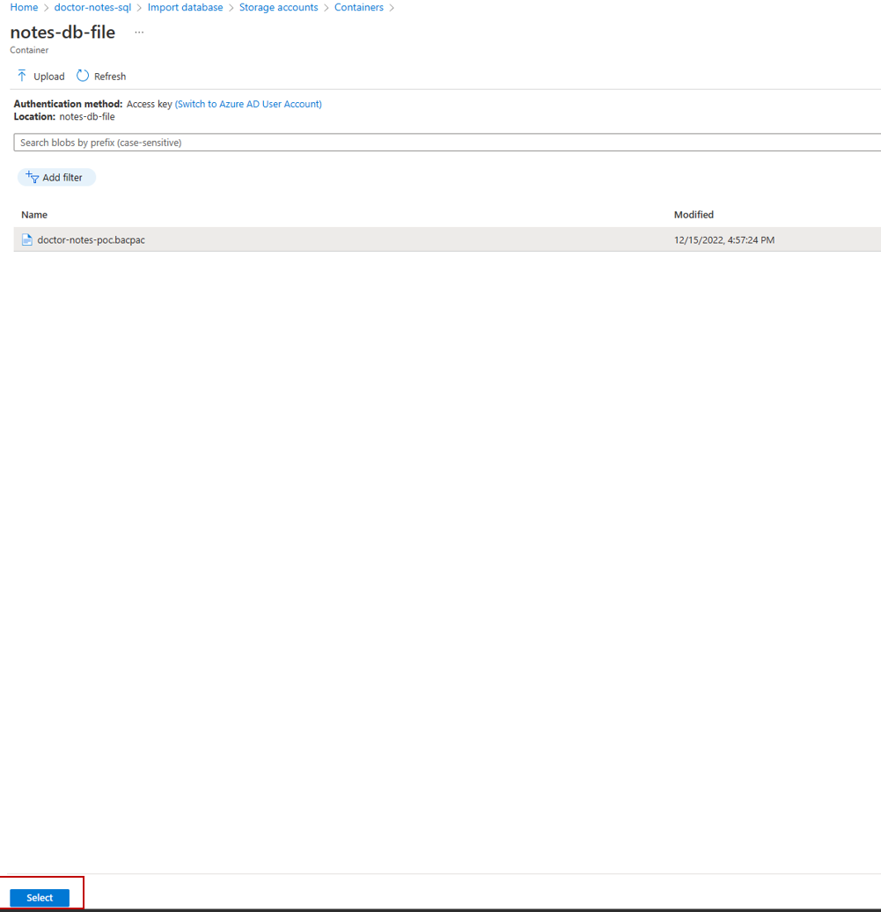

Next click configure database

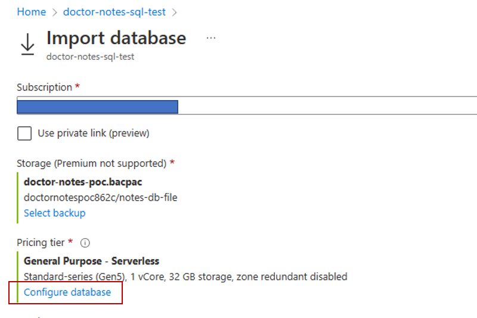

Under computer tier, select serverless, click ok

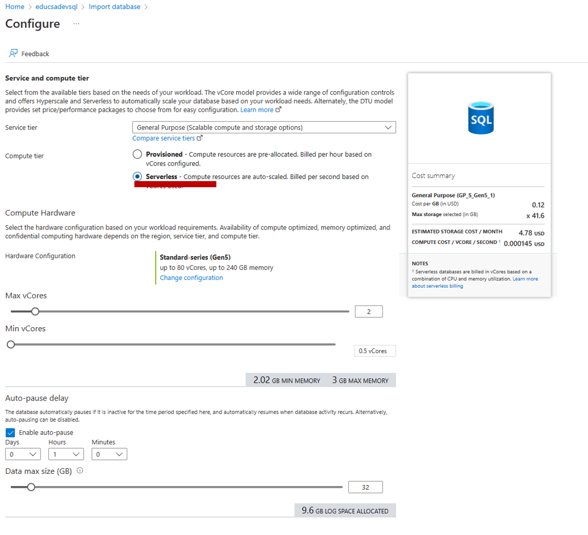

Enter a data base name, select SQL server authentication and enter the user name & password you defined for the SQL Server, click ok

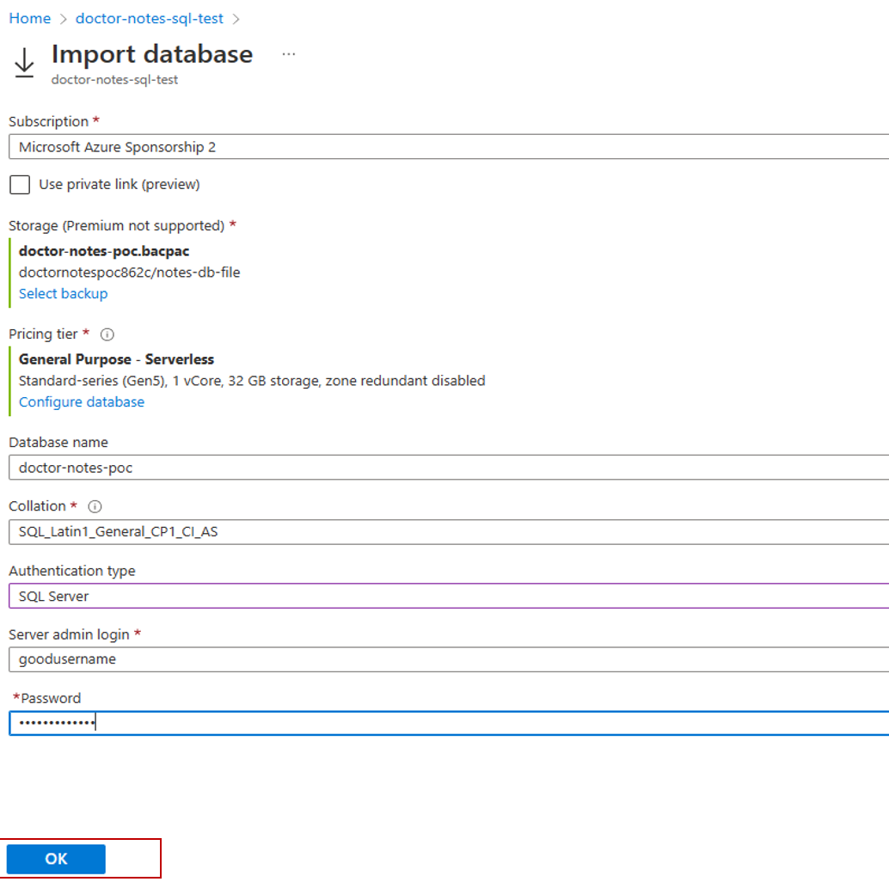

Navigate to your SQL server, and select import/export history to see the progress of your import, once completed, navigate to databases to look at your new imported database

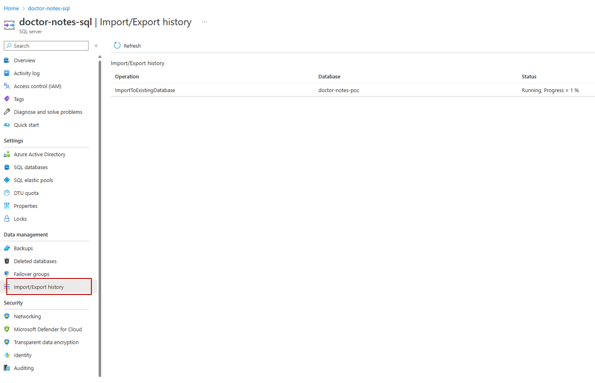

Once on your imported database, select Query editor and enter your user credentials. Loging will fail as you need to grant access to your IP address. Click on Allow IP server and then login

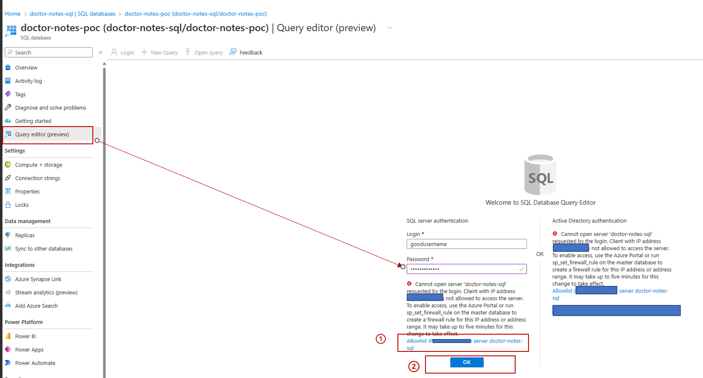

Once on the query screen copy and paste this sql statement and click Run to verify data was imported

```sql
Select * from documents
 
```

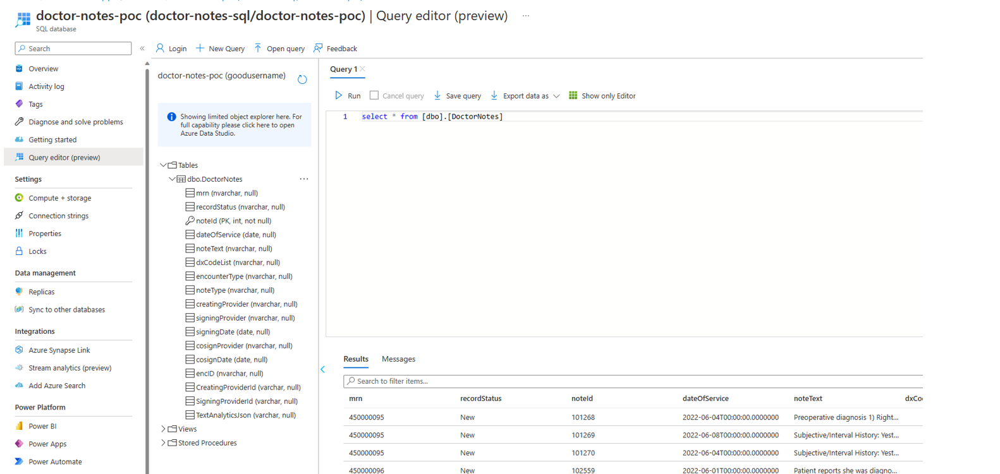

</details>


> Write the name of your sql server, database, username and password on a text file, we will need it later -->

### Task 5 - Create OpenAI Account and Deploy Models

If you do not have an OpenAI account, create one, you have your Azure OpenAI service, make suru have or deploy two models

    1. Completions model, we used `gtp-4o` for this demo,if you can, please use this model.
    2. Embeddings model, use text-embedding-ada-002 for this demo.    
    
   
If the models are alredy deployed, use those, if not, for more information on how to deploy this service and models click [here](https://learn.microsoft.com/en-us/azure/ai-services/openai/how-to/create-resource?pivots=web-portal)


 > Note the Azure OpenAI service endpoint, API key and the model name on your text file


 ### Task 6 - Create Azure Document Intelligence Service

Document intelligence will be used to chunk documents using top notch technologies to read your documents.

If you do not have a document intelligence service account, create one, for more information click [here](https://learn.microsoft.com/en-us/azure/ai-services/document-intelligence/create-document-intelligence-resource?view=doc-intel-4.0.0)


`Do not use the free SKU.`

 > Note the document intelligence service endpoint, API key on your text file

 ### Task 7 - Create Azure AI Language Service

Azure AI Language Service will be used to extract key phrases from each document chunk, you can also use Azure AI Language Service to extract sentiment analysis, Entities and more.

If you do not have a Azure AI Language Service , create one:

1. In the Azure Portal, search for “Azure AI services” and select “Create” under Language Service1.
2. Fill in the required details such as the resource name, subscription, resource group, and location. Choose the pricing tier that suits your needs (you can start with the Free tier).


 > Note the Azure AI Language service endpoint, API key on your text file

 ### Task 8 - Upload documents to storage account

Download the file `nasa-documents.zip` located under the folder `data-files`, extract the files and upload them to the container you created on step 3

### Task 9 - Configure Stored Procedure

Log into the Azure Portal, navigate to your sql database and open the query editor for the `nasa-documents` database (or you can use SQL Server Management Studio).

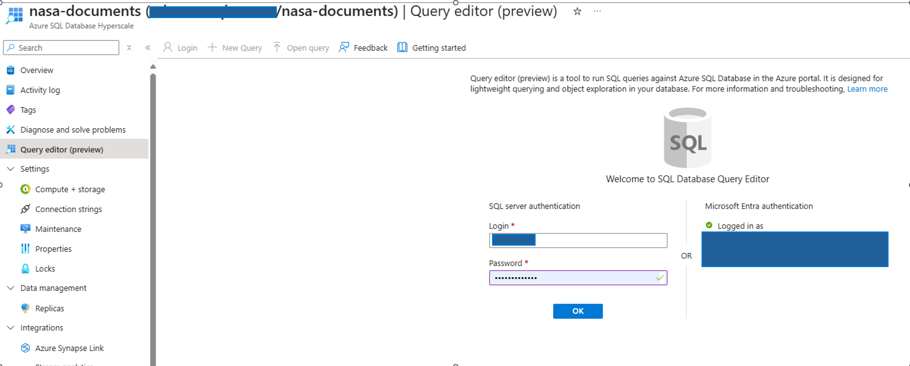

Once logged in expand the stored procedure sections, click on the elipsis and select View Definition

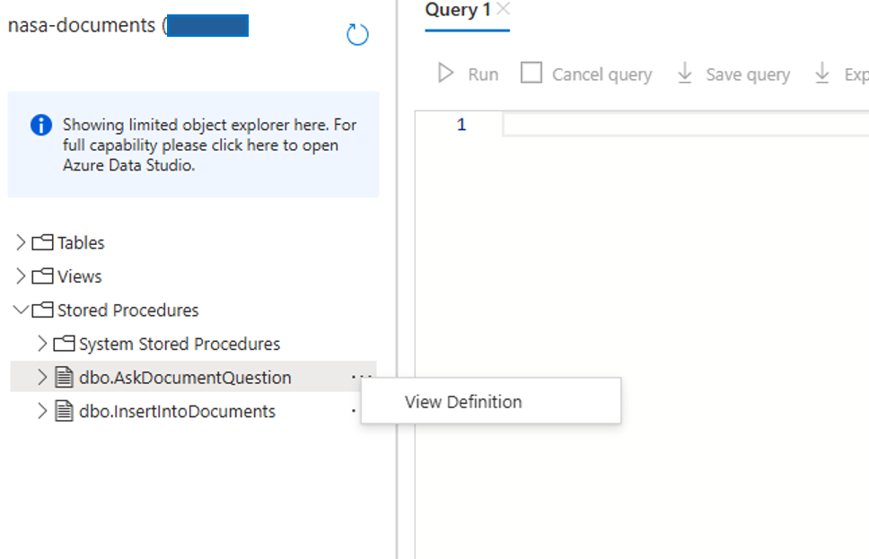

scroll down to line 33, you will need to update your OpenAI configuration there

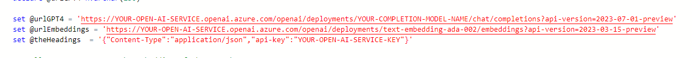

Once you make the changes, click on run.

-------------------------------------------------------------------

## Data Ingestion 

### Task 1 - Set up enviromental variables

 Using VS Studio, open the project folder.

 Provide settings for Open AI and Database.You can either create a file named `secrets.env` file in the root of this folder and use VS Code app's UI later (*easier*).
    

        AFR_ENDPOINT=https://YOUR-DOCUMENT-INTELLIGENCE-SERIVCE-NAME.cognitiveservices.azure.com/
        AFR_API_KEY=YOUR-DOCUMENT-INTELLIGENCE-API-KEY
        AZURE_ACC_NAME=YOUR-STORAGE-ACCOUNT-NAME
        AZURE_PRIMARY_KEY=YOUR-STORAGE-ACCOUNT-KEY
        STORAGE_ACCOUNT_CONTAINER=nasa-files 
        SQL_SERVER = YOUR-AZURE-SQL-SERVER.database.windows.net
        SQL_DB = nasa-documents
        SQL_USERNAME=YOUR-SQL-USER-NAME
        SQL_SECRET= YOUR-SQL-USER-PWD
        OPENAI_ENDPOINT=https://YOUR-OPEN-AI-RESOURCE-NAME.openai.azure.com/
        OPENAI_API_KEY=YOUR-OPEN-AI-API-KEY
        OPENAI_EMBEDDING_MODEL=text-embedding-ada-002
        TEXT_ANALYTICS_ENDPOINT=https://YOUR-AZURE-LANGUAGE-SERVICE-NAME.cognitiveservices.azure.com/
        TEXT_ANALYTICS_KEY=YOUR-AZURE-LANGUAGE-SERVICE-KEY

    

        

> [!IMPORTANT] 
> If you are a Mac user, please follow [this](https://learn.microsoft.com/en-us/sql/connect/odbc/linux-mac/install-microsoft-odbc-driver-sql-server-macos?view=sql-server-ver16) to install ODBC for PYODBC


## Task 2 - Run notebook to ingest

Open the SQLGraphRag Notebook and run it! 

## Task 3 - Ask a question

Go back to the query editor, create a new query and run the following tests:

### Test 1
```
declare @systemMessage varchar(max)
declare @text varchar(max)

set @systemMessage = 'Summarize the document content'
set @text  = 'Give me a summary in laymans terms, only search for the document with name silkroads.pdf'
execute [dbo].[AskDocumentQuestion] @text,@systemMessage,0
```
### Test 2
```
declare @systemMessage varchar(max)
declare @text varchar(max)

set @systemMessage = 'you are a helpful assistant that helps people find information'
set @text  = 'What are the main innovations of Nasa Science Mission Directorate?'
execute [dbo].[AskDocumentQuestion] @text,@systemMessage,0
```
### Test 3
```
declare @systemMessage varchar(max)
declare @text varchar(max)

set @systemMessage = 'Summarize the document content'
set @text  = 'what are the main topics of this database content?'
execute [dbo].[AskDocumentQuestion] @text,@systemMessage,0
```
